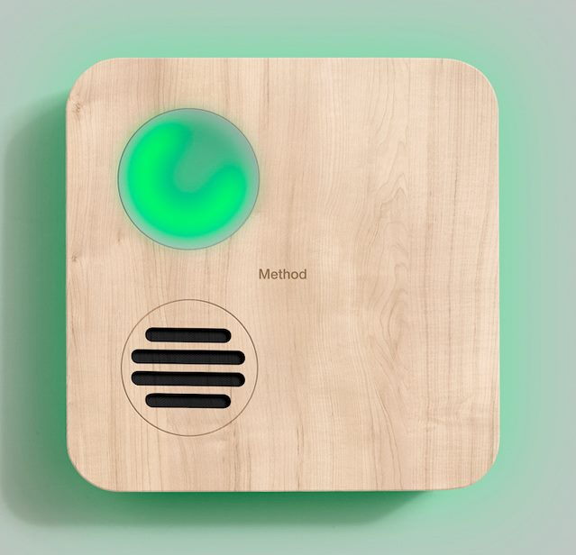
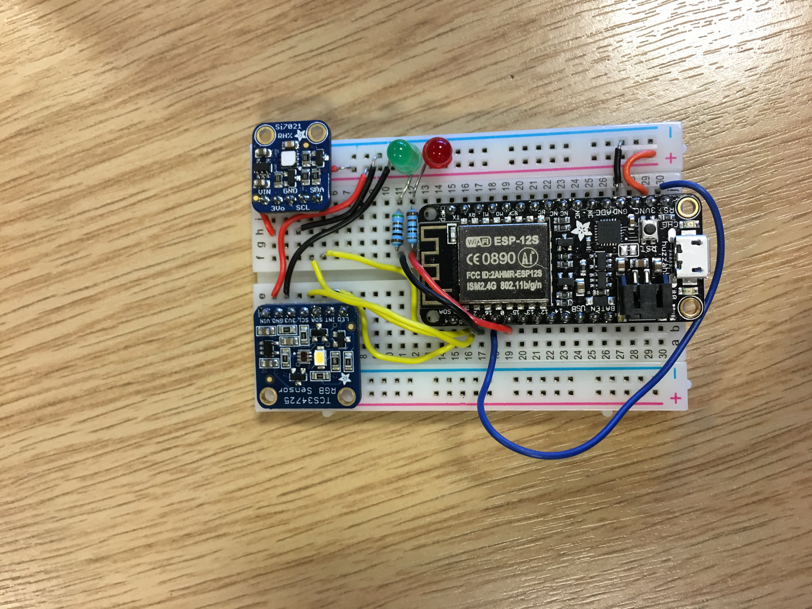

# esys_croissant_cw1_submission

# NumberWine

### We take care of your wine, you drink it!

## The product

NumberWine was created to simplify the maintenance of your wine cellar to a maximum, with minimum interaction. It is an accurate, simple and robust monitor which ensures your wine is stored under optimal conditions. 

## How it works

Numberwine is placed on a wall inside the wine cellar. The user can then manually enter the temperature, humidity and light intensity needed using a computer or mobile application. 
NumberWine then continuously monitors these parameters and reports back to the user based on the conditions. The user is notified via an alert when a value has drifted out of its allowed threshold. To minimise power consumption NumberWine can be set to go to sleep for a specific amount of time the user can input in between measurements. This way a lot of power is saved allowing the device to operate for much longer. 

## Our Board 

### Adafruit Feather HUZZAH ESP8266

* [Board Overview](https://learn.adafruit.com/adafruit-feather-huzzah-esp8266/overview)

The ESP board is used in order to communicate our values back to a broker using the I2C protocol. The voltage, serial data and serial clock pins are fed straight to the sensors. 3 other GPIO pins have been used. 2 of them in order to light a red and a green LED for receiving and sending to the broker respectively. The third GPIO pin used is connected to the RST pin in order to wake up the system when it goes to power saving mode. 

## Our Sensors 

### TCS34725 RGB Color Sensor 

* [Datasheet](https://cdn-shop.adafruit.com/datasheets/TCS34725.pdf)

The colour sensor has been used in order to read separate 16-Bit R,G,B,C values and calculate the relative intensity of the light in the room using them. Since wine remains generally unaffected by non UV light, the value of luminosity calculated can be compared to user defined thresholds and report accordingly to let the user know if a bulb has turned off or if more light than expected is somehow allowed in.

### Si7021 Humidity and Temperature Sensor 

* [Datasheet](https://www.silabs.com/documents/public/data-sheets/Si7021-A20.pdf) 

The Si7021 has been used in order to monitor the rooms temperature and humidity. These two quantities are of utmost importance to wine storing, hence we have set optimal tolerance and target values. These values can be configured by the user if needed. WineKeeper will constantly try to monitor Temperature and Humidity and report back to the user if the conditions specified have been violated. 
